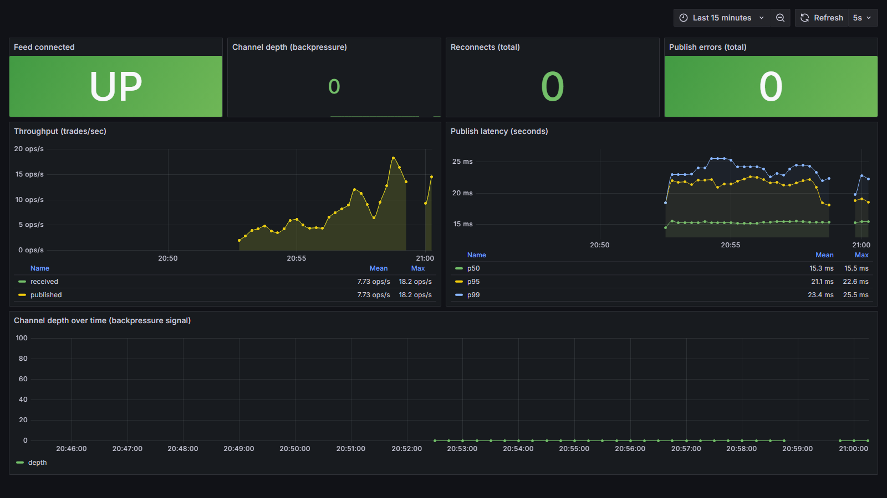
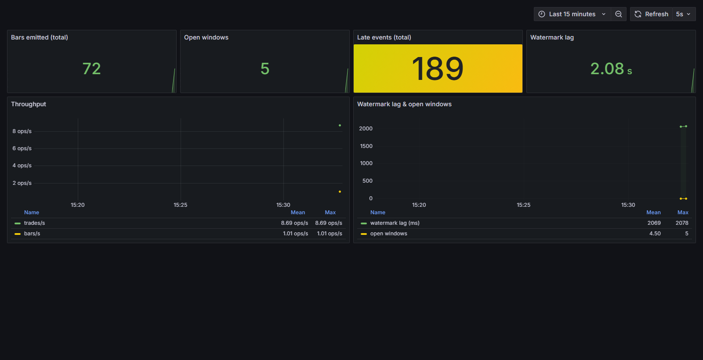
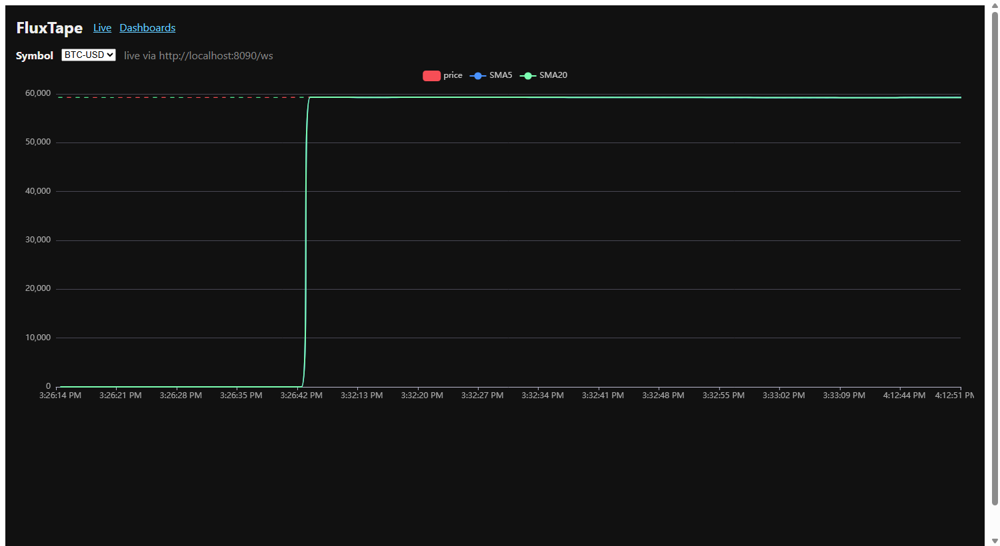
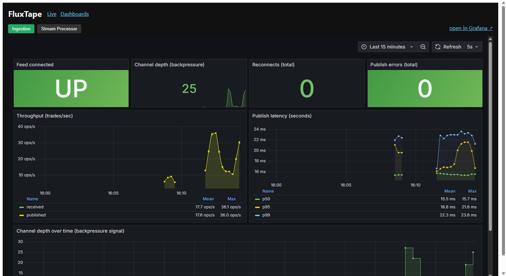

# FluxTape

Real-time crypto market-data platform: ingest live trades → stream processing
(windowed analytics, anomaly detection) → polyglot storage → low-latency API +
live dashboard, with CDC into a cold analytics store and full observability.

**Architecture & roadmap:** see [SPEC.md](SPEC.md) and
[Architecture Decision Records](docs/adr/).

## Deploy (Phase 4b — free tiers)

Managed infra: **Upstash** (Kafka + Redis), **Neon** (Postgres). Compute on
**Fly.io**; web on **Cloudflare Pages** (Vercel also works). Set provider
connection strings as platform secrets, then:

```powershell
make deploy-fly    # 5 services -> Fly.io   (fly auth login first)
make deploy-web    # React -> Cloudflare Pages
```
Note: managed Kafka needs TLS+SASL (set KAFKA_SASL_* secrets); free Postgres
has no TimescaleDB so `bars` is a plain table.

## Tech stack

| Layer | Tech |
|-------|------|
| Ingestion (hot path) | Rust |
| Event backbone | Redpanda (Kafka API) |
| Stream processor / CDC / API | Go |
| Storage | TimescaleDB · Postgres · Redis · ClickHouse (Phase 5) |
| Dashboard | TypeScript / React |
| Edge / CDN | Cloudflare Pages + Workers |
| Observability | Prometheus · Grafana · OpenTelemetry |

## Prerequisites

- **Docker Desktop** (running)
- **Go** ≥ 1.23 — for stream processor, CDC connector, API gateway
- **Rust** (stable, via rustup) — for the ingestion service

See [Local setup](#local-setup) for install steps.

## Quick start (Phase 0 — local infrastructure)

One-command runners: `make init && make up` (Linux/macOS) or
`./dev.ps1 init; ./dev.ps1 all` (Windows) bring up infra + all 5 services + web.
Manual steps below.

```powershell
# 1. Create your local env file (gitignored)
Copy-Item .env.example .env

# 2. Boot the whole stack
docker compose up -d

# 3. Check everything is healthy
docker compose ps
```

### Service endpoints

| Service | URL / Address | Notes |
|---------|---------------|-------|
| Redpanda (Kafka API) | `localhost:19092` | connect apps here |
| Redpanda Console | http://localhost:8080 | inspect topics/messages |
| TimescaleDB (Postgres) | `localhost:5432` | user/pass/db: `fluxtape` |
| Redis | `localhost:6379` | |
| Prometheus | http://localhost:9090 | |
| Grafana | http://localhost:3000 | anonymous access on; admin/admin |

### Stop / reset

```powershell
docker compose down        # stop containers, keep data
docker compose down -v     # stop AND wipe data volumes (fresh start)
```

## Dashboards

The ingestion service exposes Prometheus metrics on `:9100/metrics`, scraped by
Prometheus and visualized in a provisioned Grafana dashboard
(**Dashboards → FluxTape → FluxTape — Ingestion**, or
http://localhost:3000/d/fluxtape-ingestion):



Panels: feed connection status, channel depth (live backpressure signal),
reconnect/error counters, throughput (received vs published), and publish
latency percentiles (p50/p95/p99).

The stream processor exposes metrics on `:9101/metrics` with its own dashboard
(http://localhost:3000/d/fluxtape-processor):



Panels: bars emitted, open windows, late events, watermark lag, and throughput
(trades/s vs bars/s).

## Web dashboard (Phase 4)

React + ECharts app: live candlesticks (REST history seed + WebSocket updates)
with SMA5/SMA20 overlays, plus a Dashboards tab embedding the Grafana panels.

```powershell
cd web; npm install; npm run dev   # http://localhost:5173
```
Requires the API gateway: `cd services/api; go run .` (REST :8090, WS /ws).




## Project layout

```
SPEC.md                  Architecture, components, phased roadmap
docker-compose.yml       Local infrastructure stack (Phase 0)
.env.example             Template for local secrets/config
infra/                   Prometheus + Grafana provisioning
docs/adr/                Architecture Decision Records
docs/lessons/            Personal concept notes (gitignored)
```
